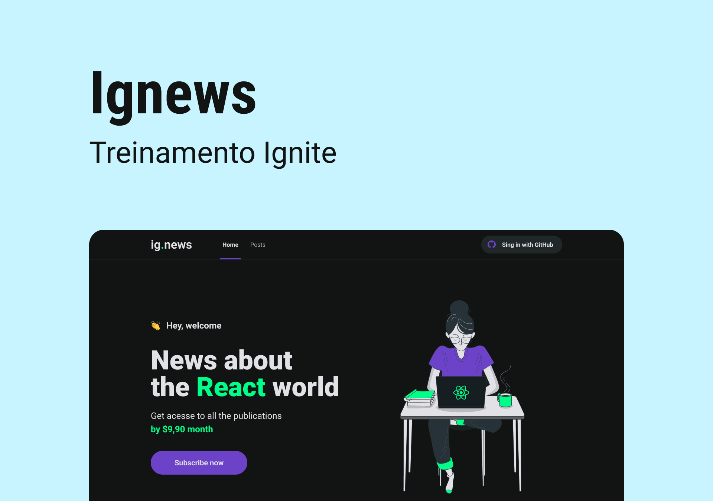

<p align="center">
  
</p>

<h4 align="center"><a href="https://ignews-sampaiocode.vercel.app">Clique para visitar o projeto</a></h4>

---

## 💻 Sobre o projeto

Esse projeto é um blog onde os usuários podem ter acesso ao conteúdo completo ou uma prévia de cada postagem de acordo com o status da sua assinatura. A assinatura é feita via Stripe e após o usuário realizar o pagamento, sua inscrição estará ativa e o usuário poderá visualizar qualquer postagem por completo. Caso o usuário não faça uma assinatura, apenas poderá visualizar uma prévia do conteúdo.

## 🛠️ Tecnologias

Este projeto foi desenvolvido utilizando as seguintes tecnologias:

- [ReactJS](https://reactjs.org/)
- [Next.js](https://nextjs.org/)
- [TypeScript](https://www.typescriptlang.org/)
- [Sass](https://sass-lang.com/)
- [NextAuth.js](https://next-auth.js.org/)
- [FaunaDB](https://fauna.com/)
- [Stripe](https://stripe.com/br)
- [Prismic CMS](https://prismic.io/)

## 🚀 Instalação

**Clone o projeto**

```bash
git clone https://github.com/sampaiocode/ignews.git
```

**Siga os passos abaixo**

```bash
# Acesse a pasta
$ cd ignews

# Instale as dependências
$ yarn

# Crie um arquivo '.env'
# Faça uma cópia de '.env.example' para '.env'
# Preencha as variáveis ambiente em seguida
$ cp .env.local.example .env.local

# Execute stripe listen para ouvir eventos do webhook
$ stripe listen --forward-to localhost:3000/api/webhooks

# Inicie a aplicação
$ yarn dev
```

## 🔖 Layout

Você pode visualizar o layout do projeto através [desse link](https://www.figma.com/file/gl0fHkQgvaUfXNjuwGtDDs/ig.news/duplicate). É necessário ter conta no [Figma](https://figma.com) para acessá-lo.

## 📝 Licença

Esse projeto está sob licença. Veja o arquivo [LICENÇA](LICENSE) para mais detalhes.

---

Desenvolvido com 💙 por [Deivit Eduardo](https://github.com/sampaiocode)
